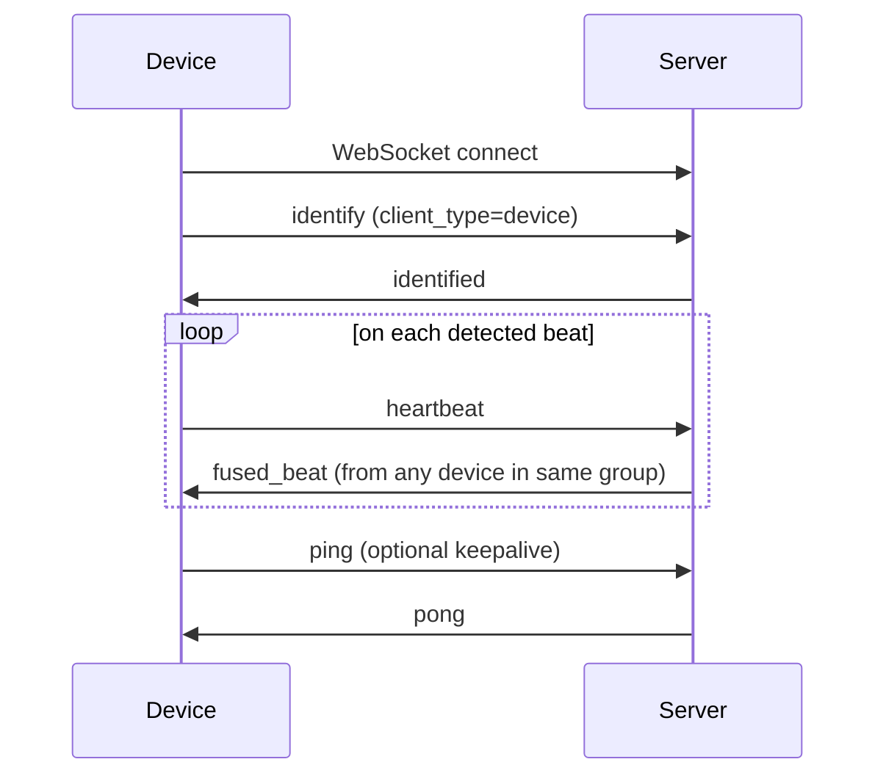
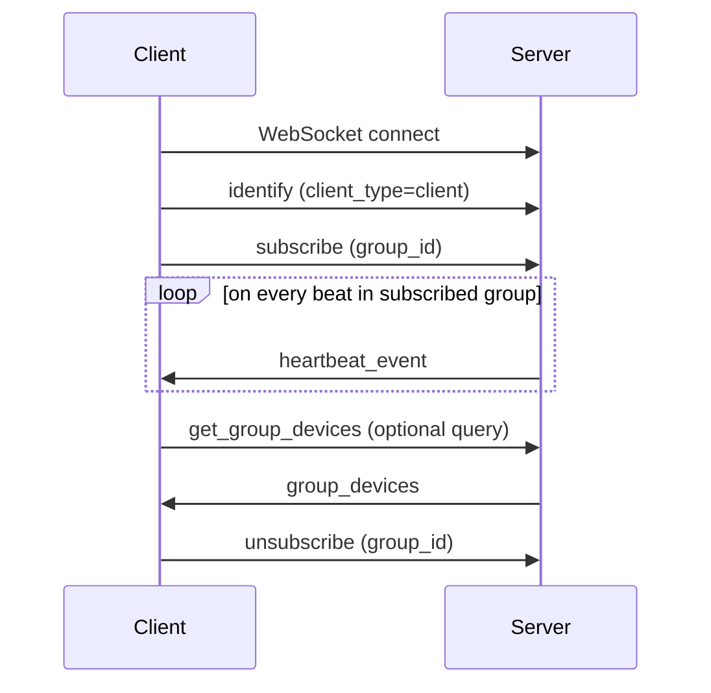
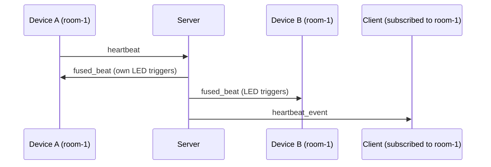

# WebSocket Protocol

All WebSocket traffic goes through a single endpoint:

```
ws://<host>:5001/ws
```

Both **devices** (ESP32-C3 wearables) and **clients** (browsers, dashboards, etc.) connect to the same endpoint. The server distinguishes them by the first `identify` message it receives.

All messages are JSON text frames.

---

## Concepts

**Device** — A FuseBeat wearable. Sends beat events. Receives `fused_beat` to trigger its LED animation.

**Client** — Any consumer of beat events (e.g. a web dashboard). Subscribes to groups and receives a stream of `heartbeat_event` messages.

**Group** — A named set of devices. A device can belong to multiple groups. A client subscribes per group. Managed via the [REST API](./rest-api.md).

**Fusion** — When a device sends a `heartbeat`, the server fans it out to every other connected device in the same group (as `fused_beat`) and to every client subscribed to that group (as `heartbeat_event`). This keeps all LEDs in a group in sync.

---

## Connection lifecycle

### Devices



### Clients



> **Note:** clients must send `identify` before any other message. Messages sent before identification are silently ignored.

---

## Messages: Device → Server

### `identify`

Sent immediately after connecting. Upserts the device record in the database.

```json
{
  "type": "identify",
  "client_type": "device",
  "device_id": "ab12",
  "feed_id": "default",
  "color": "#FF0000"
}
```

| Field | Type | Description |
|-------|------|-------------|
| `client_type` | string | Must be `"device"` |
| `device_id` | string | Last 2 bytes of MAC address, hex (e.g. `"ab12"`) |
| `feed_id` | string | Feed name stored in device NVS |
| `color` | string | Device color as `#RRGGBB` |

---

### `heartbeat`

Sent each time a beat is detected by the PPG sensor.

```json
{
  "type": "heartbeat",
  "device_id": "ab12",
  "feed_id": "default",
  "timestamp_ms": 4823910
}
```

| Field | Type | Description |
|-------|------|-------------|
| `device_id` | string | Sender's device ID |
| `feed_id` | string | Feed name |
| `timestamp_ms` | number | `millis()` since device boot — **not** wall-clock time. Use consecutive values to compute inter-beat intervals. |

---

### `ping`

Optional keepalive. The server replies with `pong`.

```json
{ "type": "ping" }
```

---

## Messages: Server → Device

### `identified`

Sent in response to a valid `identify` message.

```json
{ "type": "identified" }
```

---

### `fused_beat`

Sent to every connected device in the same group when any device in that group sends a `heartbeat` — including the originating device. Triggers the LED heartbeat animation.

```json
{
  "type": "fused_beat",
  "device_id": "ab12",
  "color": "#FF0000",
  "group_id": "room-1"
}
```

| Field | Type | Description |
|-------|------|-------------|
| `device_id` | string | Device that originated the beat |
| `color` | string | That device's color |
| `group_id` | string | Group through which the beat was fused |

> The device firmware also reads an optional `interval_ms` field to set the LED animation speed. When absent it defaults to `1000 ms`.

---

### `config`

Server-pushed configuration update. All fields are optional.

```json
{
  "type": "config",
  "color": "#00FF00",
  "feed_id": "stage"
}
```

---

### `pong`

Reply to a `ping`.

```json
{ "type": "pong" }
```

---

## Messages: Client → Server

### `identify`

Must be sent before any other client message.

```json
{
  "type": "identify",
  "client_type": "client"
}
```

---

### `subscribe`

Start receiving `heartbeat_event` messages for a group. Can be sent multiple times to subscribe to multiple groups.

```json
{
  "type": "subscribe",
  "group_id": "room-1"
}
```

---

### `unsubscribe`

Stop receiving events for a group.

```json
{
  "type": "unsubscribe",
  "group_id": "room-1"
}
```

---

### `get_group_devices`

Request the list of devices (with colors) in a group.

```json
{
  "type": "get_group_devices",
  "group_id": "room-1"
}
```

---

### `get_device_groups`

Request the list of groups a device belongs to.

```json
{
  "type": "get_device_groups",
  "device_id": "ab12"
}
```

---

## Messages: Server → Client

### `heartbeat_event`

Pushed to all clients subscribed to a group whenever any device in that group sends a `heartbeat`.

```json
{
  "type": "heartbeat_event",
  "device_id": "ab12",
  "color": "#FF0000",
  "group_id": "room-1",
  "timestamp_ms": 4823910
}
```

---

### `group_devices`

Response to `get_group_devices`.

```json
{
  "type": "group_devices",
  "group_id": "room-1",
  "devices": [
    { "device_id": "ab12", "color": "#FF0000" },
    { "device_id": "cd34", "color": "#0000FF" }
  ]
}
```

---

### `device_groups`

Response to `get_device_groups`.

```json
{
  "type": "device_groups",
  "device_id": "ab12",
  "groups": ["room-1", "all-devices"]
}
```

---

## Fusion flow



Every device in the group receives `fused_beat` — including the originating device — so all LEDs animate in unison.
